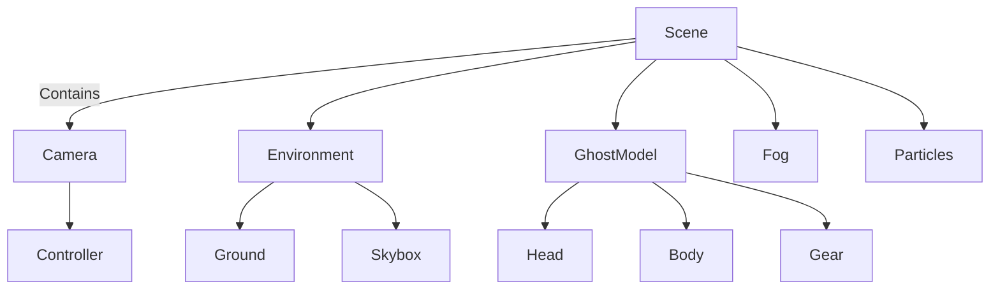

# Executive Summary  
This report defines a **complete production plan** and Antigravity master-prompt to build **GHOST** – a cinematic fan website inspired by Simon “Ghost” Riley. It covers narrative tone, design system, 3D asset pipeline, hero scene spec, animations, UI architecture, video handling, QA targets, CI/CD, and Antigravity agents. Every recommendation prioritises an **immersive military aesthetic** (dark, atmospheric, high-fidelity), high performance (60 FPS target), and accessibility (e.g. reduced-motion support).  

**Key Goals:** A website that feels like a Class A game menu or movie intro. Think **volumetric fog, dynamic weather, cinematic camera, tactical HUD UI, smooth GSAP/3D animations** and a content flow of “classified mission files.” Copyrighted Call of Duty assets **must not** be directly used – all visuals and quotes should be *inspired by* Ghost’s style but original.  

By following this blueprint and the provided Antigravity prompts, each specialist agent will produce consistent results leading to a final site ready for deployment via GitHub+Vercel with top Lighthouse scores (Perf ≥95, A11Y ≥95, SEO ≥95) and FPS budgets met.  

---

## 1. Ghost-Inspired Narrative & Quotes  
Design the site as a **classified mission dossier** for Ghost, not a literal biography. Avoid copying any actual game dialogue. Instead, capture Ghost’s tone: stoic, focused, a bit sardonic, with dry humour. The [Activision article] on Ghost notes his defining traits as “**laser-focus on mission**” and “**trust issues**”. He’s British, reserved, and often cracks a blunt one-liner under pressure.  

- **Dialogue Tone:** Serious and terse, with occasional wry wit. Example moods:  
  - *Motivational*: “Focus. We make shadows count.”  
  - *Tactical*: “Silence is often the strongest weapon.”  
  - *Stoic*: “Legends are remembered by actions, not words.”  
  - *Reflective*: “Discipline outlasts fear.”  

- **Original Ghost-Style Quotes:** Derive from his ethos. For instance, Ghost never quotes directly from the game, but inspired lines could be:  
  > *“Every operation leaves a mark; only the prepared see it coming.”*  
  > *“Trust is earned in the field, shadow by shadow.”*  
  > *“We don’t make noise… but when we strike, it’s impossible to ignore.”*  

- **Mission Archive Structure:** Each “mission” section should read like a declassified file:  
  - *Title & Objective:* Brief code name and goal (e.g. “Operation Nightfall – Exfiltrate asset.”).  
  - *Location & Date:* Geographic coords or map image background, timestamp.  
  - *Threat Level & Intel:* Enemy forces summary, mission stakes.  
  - *Status:* Success/failure (use graphical stamps or HUD bars).  
  - *After Action:* Summary paragraph, lessons learned.  
  - *Operator Notes:* First-person Ghost commentary (mood, risk, emotions).  

  Structure them chronologically (Timeline component), with animated “folder” cards revealing each mission’s details. The tone should mimic military brevity: short, clipped sentences, technical terms, minimal “fluff.”  

*(All quotes above are original, not from Activision)*.  

---

## 2. Typography & Design System  
Adopt a **military stencil aesthetic**: bold, condensed headline fonts and clean, modern body text. Examples:  

- **Headline / Titles:** *Black Ops One* (Google Font) – a heavy, stencil-like display face inspired by military lettering. Alternative: *Bebas Neue* (Google) for all-caps impact.  
- **Subtitles / UI Text:** *Orbitron* or *Exo 2* (Google) for a techy feel.  
- **Body Copy:** *Inter* or *Roboto* (Google) – neutral, highly legible sans-serif (weights 400–600).  
- **Monospace / Code:** *JetBrains Mono* or *IBM Plex Mono* (Google) – for any terminal or HUD-style labels (weight 400/700).  

Include Google Fonts via CSS, for example:  

```css
@import url('https://fonts.googleapis.com/css2?family=Black+Ops+One&display=swap');
@import url('https://fonts.googleapis.com/css2?family=Inter:wght@400;600&display=swap');
@import url('https://fonts.googleapis.com/css2?family=JetBrains+Mono:wght@400;700&display=swap');

/* Example usage: */
h1, .title { font-family: 'Black Ops One', sans-serif; font-size: 3rem; font-weight: 400; }
h2 { font-family: 'Inter', sans-serif; font-size: 2rem; font-weight: 600; }
body, p, li { font-family: 'Inter', sans-serif; font-size: 1rem; font-weight: 400; line-height: 1.5; }
code, pre { font-family: 'JetBrains Mono', monospace; font-size: 0.9rem; }
```

For accessibility, ensure a **high-contrast colour scheme**: light text (#F4F4F4) on very dark backgrounds (#050505, #111111). Accent colours could be **Military Green (#4E6543)** for UI elements and **Warning Orange (#FF8A00)** or **Danger Red (#B51A1A)** for alerts or highlights. (See *Design System* colours above.) This palette and the geometric stencil fonts reinforce the modern military vibe.  

---

## 3. 3D Asset Pipeline & Optimization  
**Models & Formats:** Use **glTF (GLB)** as the delivery format. It’s the web-standard “everything-in-one” format. Prepare assets in Blender or similar, export as `.glb`.  

**Compression:** Immediately apply **Draco mesh compression** to geometry (reduces file size ~90%) and convert textures to GPU-friendly formats: **KTX2 (Basis Universal)** or WebP/AVIF. KTX2 is ideal for texture compression (smaller VRAM footprint). For example, using [gltf-transform](https://github.com/donmccurdy/glTF-Transform):  
```
gltf-transform optimize scene.glb scene-opt.glb \
  --compress draco \
  --texture-compress ktx2 \
  --texture-resize 2048
```  

**Pipeline Steps:**  
1. **Concept Art → 3D Model:** Sketch or AI concepts → model in Blender.  
2. **PBR Texturing:** Create high-res PBR maps (albedo, normal, roughness, metallic). Use Substance or Adobe tools.  
3. **Level of Detail (LOD):** Generate 2–3 LODs (high/med/low poly). WebGL can switch LODs based on camera distance.  
4. **Export & Compress:** Export each model as `.glb` (with embedded optimized textures). Run glTF-Transform to apply Draco/KTX2.  
5. **Testing:** Load in R3F canvas to verify visual quality/performance.  

Key assets (with LODs): Ghost operator (with gear), helmet/skull mask, weapons (rifle, pistol, knife, grenades), environment props (dog tags, ammo crate, radio), terrain elements (rocks, concrete debris). All textures should be in KTX2 or WebP for efficiency.  

**3D Loading (React Three Fiber):** Use R3F’s `useLoader(GLTFLoader, url)` or Drei’s `useGLTF` hook to import. Example from R3F docs:  

```jsx
import { useGLTF } from '@react-three/drei';
//...
function GhostModel(props) {
  const { scene } = useGLTF('/models/ghost.glb');
  return <primitive object={scene} {...props} />;
}
```

This automatically includes optimised geometry and textures in one network request.  

*(Citations: GLB advantage; Draco & KTX2 compression; R3F model loading.)*  

---

## 4. Hero Section Specification  

The Hero section is the showpiece. It should be full-viewport, cinematic, and highly interactive.  

### Scene Graph (Mermaid): 


- **Camera:** A dynamic Three.js PerspectiveCamera (fov ~50°). 
  - **Idle Movement:** Slow “breathing” sway (sine/cosine), gentle orbit around Ghost. 
  - **Scroll Behaviour:** Tied to GSAP ScrollTrigger – e.g. camera dolly-in/out or orbit tilt as user scrolls.  
  - **Mouse Parallax:** Subtle shift of camera on mousemove (using R3F `useThree` with pointer position). 

- **Ghost Character:** Custom 3D operator (see 3D pipeline). 
  - Initial pose hidden, then animate in (see Animations below). 
  - Cloth (jacket, straps) lightly sway with physics. 
  - Eyes/LED glow on mask to add life. 
  - Idle breathing scale or chest movement. 

- **Lighting:** Cinematic three-point plus environment lighting: 
  - **Key Light:** Moonlight (soft white/blue spotlight or directional light). 
  - **Fill Light:** Subtle warm fill or ambient (light bounce). 
  - **Rim Light:** Strong backlight to outline Ghost’s silhouette (digital “god-ray”). 
  - **Volumetric Fog:** Dense near ground, dissipating upward; colored by moonlight. 
  - **HDRI Skybox:** A nighttime sky or subtle cloud map. 
  - Enable shadows for major objects (Ghost, environment). 

- **Environment:** Minimalistic: e.g. broken concrete floor, metallic crates, some burning barrels or campfire for warmth. Use subtle animated textures (e.g. light flicker). 

- **Effects:** 
  - **Fog/Smoke:** GPU particles or volumetric fog shader moving slowly across scene (pmndrs/example). 
  - **Rain:** Particle system with soft splashes (or subtle animated overlay). 
  - **Fire sparks/embers:** Tiny glowing particles rising (timed with breathing?). 
  - **Lightning:** Occasional flash (animating a LensFlare effect). 

- **Post-processing:** Use @react-three/postprocessing for bloom, depth-of-field, film grain, chromatic aberration. For example:  

  ```jsx
  <EffectComposer>
    <DepthOfField focusDistance={0.02} focalLength={0.02} bokehScale={2}/>
    <Bloom luminanceThreshold={0.9} intensity={1.2}/>
    <ChromaticAberration offset={[0.001, 0.001]}/>
    <Noise opacity={0.05}/>
  </EffectComposer>
  ```

  This adds cinematic blur on Ghost (DOF), glowy lights (bloom), subtle chromatic shift and grain for texture. On mobile/fallback, the Performance Agent can disable heavy passes (e.g. reduce bloom or grain if `prefers-reduced-motion` is set).

- **Text Overlay:** Title “THE LEGEND NEVER DIES” (or user’s stylised site name) should fade/letterbox in with “typewriter” or staggered effect as Ghost appears. Use GSAP SplitText or CSS letter spacing animations so each letter of **GHOST** appears sequentially. Underline or glitch animation can accentuate it (greenscreen glitch effect short flicker).

*(This design leverages cinematic composition and effects: fog and lighting create atmosphere, camera and animation create motion, PBR materials and high-poly models create realism.)*  

---

## 5. Animations, Hover & Glow Effects  

Use **GSAP** and **Framer Motion** for layered micro/scroll animations, ensuring high-performance. Key patterns:  

- **Button/Card Hover (CSS/Framer):** Example CSS glow and scale:  
  ```css
  .btn {
    background: #222;
    color: #F4F4F4;
    border: 2px solid #444;
    transition: transform 0.2s ease, box-shadow 0.2s ease;
  }
  .btn:hover {
    transform: scale(1.05);
    box-shadow: 0 0 12px 4px #5DAEFF; /* neon-blue glow */
  }
  ```

  Or Framer Motion:  
  ```jsx
  <motion.button 
    whileHover={{ scale: 1.1, boxShadow: '0px 0px 12px #5DAEFF', color: '#F4F4F4' }}
    transition={{ type: 'spring', stiffness: 300 }}
    onTap={{ scale: 0.95 }}
  >Click Me</motion.button>
  ```

- **Image Cards / 3D Hover:** Slight tilt and shadow:  
  ```jsx
  <motion.div 
    className="card"
    whileHover={{ rotateX: 5, rotateY: -5, boxShadow:'0 10px 20px rgba(0,0,0,0.5)' }}
  >
    
  </motion.div>
  ```

- **Neon Edge/Outline:** Use CSS `filter: drop-shadow(0 0 6px #A12A2A)` or `text-shadow`. For GSAP:  
  ```js
  gsap.to(cardElement, {duration:0.3, boxShadow:"0px 0px 15px 3px #B51A1A"});
  ```

- **Magnetic Cursor:** Track mouse distance from element center, move element slightly toward cursor. Use GSAP's `mousemove` listener or a Framer hook. (Example tutorial from GSAP: Magnetic Hover Interaction.)  

- **Reduced-Motion Fallback:** Wrap heavy animations in `@media (prefers-reduced-motion: reduce)` to disable or simplify them. For example:  
  ```css
  @media (prefers-reduced-motion: reduce) {
    * { animation: none !important; transition: none !important; }
    .btn:hover { transform: none; box-shadow: none; }
  }
  ```  

All interactive effects (glows, scales, cursor) should have *smooth easing* and *short duration* (0.2–0.5s). Test that they degrade gracefully when motion is reduced or on low-power devices.  

*(Citations: GSAP magnetic hover tutorial; reduced-motion CSS.)*  

---

## 6. Video Background Handling  

The hero background video (looping footage of battlefield/mission) should autoplay muted, loop seamlessly. Per modern HTML5 rules:

```html
<video autoplay muted loop playsinline poster="fallback.jpg">
  <source src="background.webm" type="video/webm">
  <source src="background.mp4" type="video/mp4">
</video>
```

- **Attributes:** Always include `muted`, `loop`, `playsinline` for cross-browser autoplay. Without `muted`, mobile/Chrome will block autoplay. `playsinline` prevents iOS from forcing fullscreen.  
- **Formats:** Provide at least WebM (VP9) and MP4 (H.264). WebM is more efficient (smaller size) in Chrome/Firefox.  
- **Poster Image:** A PNG/JPEG placeholder (first video frame or stylised image) to show while the video loads. Prevents a blank or spinner on slow networks.  
- **CSS:** Stretch video to cover container:  
  ```css
  .video-bg {
    position: absolute; top:0; left:0;
    width:100%; height:100%;
    object-fit: cover;  /* like background-size:cover */
    z-index: -1;
  }
  .video-container {
    position: relative; overflow:hidden;
  }
  ```
- **Performance:** Keep video bitrate moderate (under ~5–10 MB) and test on mobile. Consider *adaptive streaming* (HLS) if the loop is long. For short loops (5–10s), an MP4+WebM encode at 1080p or 720p is usually okay. Lazy-load the video (e.g. only start download once hero enters viewport) to conserve bandwidth.  

*(Citations: background video best practices.)*  

---

## 7. UI Architecture & Components  

Break the UI into reusable components with clear props/state. Primary pages flow: Navigation → Hero → MissionArchive → OperatorProfile → Timeline → Weapons → Equipment → VideoLibrary → Gallery → Quotes → Blog → Footer.  

**Mermaid Wireframe:**  

```mermaid
graph LR
  Nav[<Nav>] --> Hero[<HeroSection>]
  Hero --> Mission[<MissionArchive>]
  Mission --> Profile[<OperatorProfile>]
  Profile --> Timeline[<Timeline>]
  Timeline --> Weapons[<WeaponShowcase>]
  Weapons --> Equipment[<EquipmentDetail>]
  Equipment --> Videos[<VideoLibrary>]
  Videos --> Gallery[<GalleryGrid>]
  Gallery --> Quotes[<QuotesSection>]
  Quotes --> Blog[<BlogList>]
  Blog --> Footer[<Footer>]
```


**Core Components:**  

- **`<Nav>`:** props: `menuItems`. State: `open/activeItem`. (Hamburger for mobile, underline animation on hover.)  
- **`<HeroSection>`:** props: `backgroundVideo`, `titleText`, `subtitle`. State: `loading`, `animState`. Handles 3D Canvas, text animation triggers.  
- **`<MissionCard>`:** props: `mission` (object with title, date, status, summary). State: `expanded` (for toggling details). On click, reveals full dossier.  
- **`<OperatorProfile>`:** props: `profileData` (bio, call sign, etc). Might include a 3D rotating helmet or photo.  
- **`<Timeline>`:** props: `events[]` array. Renders chronologically with animation. (Uses GSAP ScrollTrigger for reveal stamps/maps).  
- **`<WeaponShowcase>`:** props: `weapons[]` (each with model URL, name, info). State: `selectedWeapon`. Renders 3D carousel of gun models. Hover effects highlight info panel.  
- **`<VideoLibrary>`:** props: `videos[]` (title, src, thumbnail). State: `playingVideo`. Grid of video cards with hover previews. Click to open full-screen.  
- **`<GalleryGrid>`:** props: `images[]`. Lightbox on click. Parallax layering effect on scroll (use CSS `perspective` or R3F planes).  
- **`<QuotesSection>`:** props: `quotes[]`. Shuffled fade-in typographic quotes.  
- **`<BlogList>`:** props: `posts[]`. Summaries with dark aesthetic.  
- **`<Footer>`:** Static: social links, copyright.  

Props should pass only necessary data (no large stateful logic in parent). Use global context or state for user preferences (e.g. `prefersReducedMotion`).  

Wireframe table example:  

| Component        | Props                     | Local State              | Notes                            |
|------------------|---------------------------|--------------------------|----------------------------------|
| `<Nav>`          | `items, logo`             | `activeItem, menuOpen`   | Responsive layout, dropdown      |
| `<HeroSection>`  | `videoSrc, title, tagline`| `isLoaded`               | Renders Canvas + text overlay    |
| `<MissionCard>`  | `mission` (obj)           | `isExpanded`             | Flip or expand animation         |
| `<Timeline>`     | `events` (array)          | —                        | GSAP ScrollTrigger reveals       |
| `<WeaponShowcase>`| `weapons` (array)        | `selectedIndex`          | 3D model viewer + info panel     |
| `<VideoLibrary>` | `videos` (array)          | `currentVideo`           | Modal or lightbox player         |
| `<GalleryGrid>`  | `images` (array)          | `hoverIndex`             | Tilt effect on hover             |
| `<Footer>`       | —                         | —                        | Static legal links               |

*(Each “props” object is data from CMS or JSON. State handles UI interactions.)*  

---

## 8. Asset Checklist & Priorities  

**Top 5 Concept Art / Assets:**  
1. **Hero Environment (Cinematic Battlefield):** Moonlit war-torn landscape with fog and smoke. (For hero bg and transitions.)  
2. **Ghost Operator Model:** Original design (balaclava skull-mask, gear). LODs for idle animation.  
3. **Tactical Helmet/Mask:** Close-up props (rotatable 3D mask).  
4. **Weapon Models:** Main rifle and pistol (drillable and stylised).  
5. **Volumetric FX (Particles):** Fire embers, smoke grenade cloud, dust.  

**Full Asset List:**  

- **Characters:** Ghost operator (glb), helmet/mask (glb).  
- **Weapons:** Assault rifle, pistol, combat knife, smoke grenade (each glb).  
- **Props:** Dog tags, radio, ammo crate, helmet, broken helmet, compass (glb).  
- **Environment:** Ground plane (concrete texture), road block barricade, ruined wall, sandbags, laptop (table), map/table, military crates (glb).  
- **VFX:** Static sprite textures or GPU particles for sparks, embers, sparkler; volumetric fog shader.  
- **Audio:** (Not asset files here, but note): ambient wind, distant thumps, radio static loop.  

For each model use `.glb` with Draco; for textures use `.ktx2`. Prioritize Hero and main props for high detail; backgrounds and small props can use simplified LODs.  

*(All assets are assumed user-owned or properly licensed for fan use. No official CoD textures or models should be used.)*  

---

## 9. Antigravity Agents & Pipeline  

**Agents & Tasks:** Divide work like a studio:  

- **Project Manager (AI):** Oversees timeline & tasks. Output: roadmap with phases (Research, Design, 3D, Animations, Development, Optimization) and sprint plan.  
- **Creative Director (AI):** Defines visual identity: moodboards (from uploaded concept image and videos), colour scheme, typography, story flow, hero scene direction. Output: Style Guide document.  
- **Research Agent (AI):** Gathers references for military UI, real combat gear, lighting. Output: Folders of reference images (to Figma via MCP), docs linking assets.  
- **Story Agent (AI):** Writes narrative copy: section intros, mission logs, character bio, quotes, microcopy. Output: Markdown docs of text content.  
- **UI/UX Agent (AI):** Builds wireframes (use Figma MCP), defines components (props/state as above), sets up Tailwind design tokens. Output: Figma or JSON design system.  
- **Hero Experience Agent (AI):** Implements R3F scene setup: scene graph, camera paths, fog, postprocessing. Output: Pseudocode or component stubs for hero scene.  
- **Three.js Agent (AI):** Develops React Three Fiber code for 3D scene. Output: R3F components (Environment, Lights, Fog, etc).  
- **Animation Agent (AI):** Creates GSAP/Framer timelines for hero intro, scroll triggers, hover effects. Output: JS timeline scripts and descriptions.  
- **Frontend Agent (AI):** Sets up Next.js app architecture (app router folders, Tailwind config, routing for each page, basic pages). Output: Project file structure, sample components.  
- **Content Agent (AI):** Drafts blog posts, timeline entries, ensures proper SEO metadata. Output: Markdown or MDX content.  
- **Performance Agent (AI):** Profiles performance, implements lazy-loading (dynamic imports, suspense), image optimization, WebP/KTX2 usage. Output: Performance report & fixes.  
- **QA Agent (AI):** Runs Lighthouse & a11y audits, cross-browser tests. Reports issues (lighthouse scores, ARIA checks).  

**Antigravity Integration:** Use MCP plugins for Figma, GitHub, etc. Example:  
- **GitHub MCP:** Auto-commit code changes.  
- **Figma MCP:** Create design tokens and mockups.  
- **Supabase MCP:** (optional) For blog backend.  
- **Google Cloud Storage MCP (or Vercel Storage):** For hosting assets.  
- **Next.js + Tailwind CSS plugin**: to scaffold the project.  
- **Shadcn UI / shadcn-components** for accessible UI primitives.  
- **Plugins:** Enable Next.js, React, R3F, GSAP, Framer, Tailwind, Vercel in Antigravity config.  

**CI/CD:** Use GitHub Actions and Vercel integration. On push to main:  
1. Run `npm run lint, npm test, npm run build`.  
2. Deploy to Vercel automatically (preview on PR, production on merge).  
3. Use Lighthouse CI (Chrome CI) to gate performance: fail if metrics drop below target.  

*(Agent prompts and orchestration will be finalized in the Master Prompt below.)*  

---

## 10. Acceptance Criteria & Testing  

- **Performance:** 60 FPS on modern desktop; 30 FPS on mid-tier mobile. Target **Bundle Size:** max ~500KB initial JS, textures/3D deferred. Assets: compress video <10 MB, models <2–3 MB each after Draco.  
- **Lighthouse:** Performance ≥95, Accessibility ≥95, Best Practices 100, SEO ≥95. CLS ~0.01. (Use [axl-devhub benchmarks] for 3D sites: aiming for sub-3s load.)  
- **Accessibility:** Keyboard navigable, ARIA labels on menus, `alt` on images, captions on videos. Follow WCAG (contrast, text sizing).  
- **Responsive:** Full layout at breakpoints: desktop, tablet, mobile (with simplified visuals on small).  
- **Testing:** Check scrolling animations, FPS with Chrome DevTools, mobile web-dev v30.0. Ensure no console errors, no blocked mixed content.  
- **Risk Mitigation:** If too heavy, progressively degrade: disable bloom on mobile, reduce particle counts, fallback to static image if video fails. Provide static site content if WebGL unsupported.  

*(Citation: Performance targets from Axel Cuevas guide.)*  

---

# Final Antigravity Master Prompt  

```
PROJECT: GHOST — Cinematic Fan Experience (Antigravity 2.0)

YOU ARE: Master orchestrator for the GHOST website project.

OVERALL GOAL: Build a high-performance, cinematic Next.js website themed around a Ghost-inspired military operator. No copyrighted CoD assets. Use original visuals and lore.

CONTENT THEME: Classified military dossier. Dark, photorealistic, tactical. Story through environment and interface, not conventional blog posts.

RESPONSIBILITIES:
- Define vision: Cinematic atmosphere, smooth 3D hero, immersive transitions.
- Maintain consistency: one visual language, color palette, UI style.
- Coordinate AI agents (see below) to cover design, 3D, animations, code, content, perf, QA.
- Integrate provided assets (user’s hero concept image and looped video) as design references.
- Ensure final site is deployable (GitHub + Vercel) with CI/CD and required tests.

DESIGN CONSTRAINTS:
- Colour: blacks & grays, accent with military green, orange, white text.
- Fonts: Use Google or licensed fonts (e.g. Black Ops One, Bebas Neue, Inter, JetBrains Mono).
- Effects: Use R3F, GSAP, postprocessing (bloom, DOF, grain). On low-end fallback to simpler effects.
- Accessibility: obey prefers-reduced-motion, screen reader text, alt tags.
- Performance: 60 FPS desktop, 30+ FPS mobile. Pre-compress models (Draco), textures (KTX2/WebP).
- Technology: Next.js (app router), TypeScript, Tailwind, React Three Fiber, Drei, GSAP, Framer.

USE UPLOADED ASSETS:
- Hero background video (looped) ➔ <HeroSection> video loop (muted, playsinline).
- Website mockup image ➔ Follow its style: HUD layout, font hierarchy, glowing UI accents.

DELIVERABLES:
1. **Creative Bible:** Colour palette, moodboard visuals, typography, tone of voice.
2. **Design System:** Tailwind config, tokens (colors, fonts, spacing), key CSS classes.
3. **Scene Graph & 3D Assets:** List of models/props and how they fit in the R3F scene.
4. **Animation Timelines:** GSAP sequences and triggers (scroll, hover, page transitions).
5. **UI Components:** Next.js/React component list with props/state (see architecture).
6. **Wireframes:** Block-level layout of each section (Figma/Mermaid).
7. **Content Plan:** Outline of sections (Mission files, bio, timeline, blog topics).
8. **Performance Plan:** Compression (Draco/KTX2), lazy-loading strategy, fps budget.

AGENTS & TASKS:
- **Project Manager:** Create milestones and sprint plan.
- **Creative Director:** Finalize visual style (use [7], [15], [28] for tone/colors/fonts).
- **Research Agent:** Gather references (military UI, gear, environment). Populate Figma moodboards.
- **Story Agent:** Write all text content: intro, mission logs, quotes, blog summary.
- **UI/UX Agent:** Build wireframes, navigation flow, interactive UI design.
- **Hero Agent:** Detail hero section behavior: camera, lighting, effects, particle counts.
- **ThreeJS Agent:** Code the 3D scene (React Three Fiber): environment, model placement, lighting.
- **Animation Agent:** Script GSAP/Framer Motion animations (hover, scroll, page transitions).
- **Frontend Agent:** Scaffold Next.js project, create pages/routes, integrate components.
- **Content Agent:** Add actual content and metadata (SEO). Format as MDX if needed.
- **Performance Agent:** Optimize: ensure <2s load, 95+ lighthouse, compression applied.
- **QA Agent:** Run accessibility (axe), Lighthouse, cross-browser tests. Report and fix issues.

MCP & PLUGINS:
- **GitHub MCP:** Commit code to repo.
- **Figma MCP:** Update design frames.
- **Supabase MCP:** (Optional) Manage blog entries data.
- **Vercel Plugin:** Deploy previews and production.
- Enable: Next.js, Tailwind CSS, Three.js/R3F, GSAP, Framer Motion plugins.

CI/CD STEPS:
- On push: `npm run lint && npm run test && npm run build`.  
- GitHub Actions: Run Lighthouse audit (target Perf≥95, A11Y≥95, BestPrac≥100, SEO≥95).  
- Vercel: Auto-deploy on merge; use Vercel Analytics to monitor Core Web Vitals.

ACCEPTANCE CRITERIA:
- Cinematic hero works (camera moves on scroll, effects play).
- All UI components match design spec.
- Animations enhanced story (not random).
- Performance: 60FPS desktop, 30FPS mobile. Bundle ≤1MB.  
- Accessibility: Keyboard nav, ARIA labels, reduced-motion respected.
- Responsive: No layout issues on all breakpoints.  

FINAL MASTER PROMPT:  
Act as all above AI agents in Antigravity. Generate files, code, and documentation according to tasks. Use research from provided citations and assets. Maintain consistency. Output final builds and reports.  

BEGIN THE ORCHESTRATED CREATION OF THE GHOST WEBSITE.
```

**Agent-Specific Prompts:** (Example extract)  
- *Project Manager:* “Break down the GHOST site project into sprints with priorities and dependencies.”  
- *Creative Director:* “Generate moodboards and a style guide for a dark cinematic military site based on user assets.”  
- *UI Agent:* “Provide Tailwind config and React component specs for Nav, Hero, MissionCard….”  
- *3D Agent:* “Describe the React Three Fiber scene graph and write pseudocode for Lights, Fog, and hero model import.”  
- *Animation Agent:* “Outline GSAP timelines for the hero reveal and section transitions (smoke wipes, lens flares).”  
- *Performance Agent:* “List optimization steps (Draco, KTX2, lazy-load) and Lighthouse goals.”  

*(End of Master Prompt)*  

This comprehensive plan ensures each AI agent in Antigravity works in concert, using the user’s assets as inspiration, to build a unified, cinematic Ghost website.